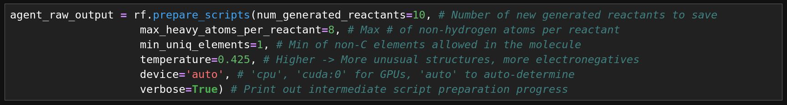
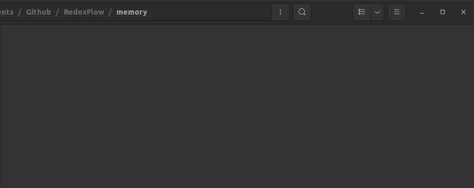

# RedoxFlow: Agentic workflow for preparing simulations in high-throughput redox-potential screening 

RedoxFlow generates candidate organic molecules, proposes reduced products, and auto-prepares simulation inputs to compute thermodynamic (Nernstian) redox potentials via the **Computational Hydrogen Electrode (CHE)** method \[1].
<p align="center">
  
</p>
<p align="center">
  
</p>

---

## Why Redox Potentials?
Redox potential quantifies how readily a molecule is oxidized or reduced. Mapping **E** across chemical space is a fast screener of **thermodynamic driving force** (via ΔG = −zFE): it lets you quickly rank candidates, estimate feasible cell voltages, and check compatibility with solvent/electrolyte stability windows and pH before doing any heavy kinetic/mechanistic work. For Proton-coupled electron-transfer (PCET) steps, CHE also exposes the pH-dependence (Nernst slope), enabling screening across operating conditions by adjusting calculated redox potentials for pH after-the-fact.

Redox potentials are especially useful in:
- **Batteries / Flow batteries:** target voltage windows (∆E ≈ E_cathode − E_anode) while respecting solvent/electrolyte stability.
- **Bio/Photoelectrochemistry:** choose mediators/analytes whose E minimizes O₂/H₂ interference and matches desired driving force.
- **Environmental electrochemistry:** assess spontaneity/selectivity along the redox ladder for contaminant transformations.
- **Redox-swing separations / CO₂ capture:** tune E to set binding–unbinding windows and energy efficiency.

CHE computes redox potentials from a thermodynamic cycle. RedoxFlow automates input preparation and post-processing—extracting energies and computing \(E=-\Delta G/(zF)\) from completed runs. It does **not** launch or manage simulations. Pair it with your scheduler or workflow engine (e.g., Slurm, Nextflow, Snakemake) to run jobs at scale; this project’s focus is robust preparation and calculation, enabling high-throughput screening when integrated into a broader execution pipeline.

---

## TL;DR
- **Generates reactants** (_de novo_) with a lightweight foundation model (`ibm-research/GP-MoLFormer-Uniq`)
    - Unrealistic moieties/ring strained systems auto-filtered out
    - 
- **Predicts reduced products** (transparent rule-based POC)
- **Does conformer search** and picks lowest-energy structures
- **Writes simulation scripts** for both states and **computes** \(E = -ΔG/(zF)\) for completed simulations

---

## Install

Tested on HPC (PSC Bridges-2, Linux-based)

Tested locally (OS: Ubuntu 22.04.5 LTS, GPU: GeForce RTX 3090)
```
git clone <this-repo> RedoxFlow
cd RedoxFlow
mamba env create -p ../redoxflow -f env/redoxflow.yml
conda activate ../redoxflow
```

The agent generates simulation inputs and calculates redox potential from successful simulations but does not launch/manage simulations. We forego doing this due to resource costs but envision it as future steps for the project. 

For our test cases `RedoxFlow/redox_calculation_test`, we run the simulations via an NWChem docker image and provide reproducible steps below.

Installing NWChem Docker Image

```
# 1) Make sure Docker Engine is installed (skip if you already have it)
#    Install guide: https://docs.docker.com/engine/install/

# 2) Pull the current MPI-enabled NWChem image from GHCR
docker pull ghcr.io/nwchemgit/nwchem-dev.mpi-pr:latest

# 3) Confirm it’s on your machine
docker images | grep nwchem
```

## Agent Demonstration

**Generate Reactants & Auto-prepare Scripts & Calculate Redox Potential**

`RedoxFlow/scripts/agent_demonstration.ipynb`

**Running NWChem Simulations (to validate script preparation)**

How to run a prepared simulation by the agent (32 MPI ranks were used in this case for a 32-core CPU)

Example Script Folder:

`/path/to/RedoxFlow/redox_calculation_test/reactants/react_2`

```
# 1) Set your job folder (note the quotes for the space)
HOSTDIR="/path/to/RedoxFlow/redox_calculation_test/reactants/react_2"

# 2) Run a single job (32 MPI ranks; 1 OpenMP thread each)
docker run --rm --shm-size=1g \
  -e MYNPROC=32 -e OMP_NUM_THREADS=1 \
  -v "$HOSTDIR":"$HOSTDIR" \
  -w "$HOSTDIR" \
  ghcr.io/nwchemgit/nwchem-dev.mpi-pr:latest \
  react_2.nw > react_2.out 2>&1
```

Or, for the equivalent product,

Example Script Folder:

`/path/to/RedoxFlow/redox_calculation_test/products/prod_2`

```
# 1) Set your job folder (ABSOLUTE FILEPATH)
HOSTDIR="/path/to/RedoxFlow/redox_calculation_test/products/prod_2"

# 2) Run a single job (32 MPI ranks; 1 OpenMP thread each)
docker run --rm --shm-size=1g \
  -e MYNPROC=32 -e OMP_NUM_THREADS=1 \
  -v "$HOSTDIR":"$HOSTDIR" \
  -w "$HOSTDIR" \
  ghcr.io/nwchemgit/nwchem-dev.mpi-pr:latest \
  prod_2.nw > prod_2.out 2>&1
```
---
## Proof-of-Concept Restrictions

To show that the agentic workflow works start-to-finish, we restrict our agent to generate molecules and prepare simulation scripts for:
* CNOF-containing molecules
* A model reduction reaction `A + xH^+ + ye^- → B`
    * No degradation products considered
    * By nature of the model reaction, we only consider PCET-reactions.
* PBE Functional
* def2-SV(P) basis set
* Pure water (dielectric constant ~ 78.4)
* Room temperature


For a round-trip demonstration of redox potential calculation with the agent/embedded class interface, we:
* Generate 3 simulations (3 reactants/3 products) and thus auto-extract variables and auto-calculate 3 redox potentials (in demonstration notebook)
    * `/path/to/RedoxFlow/redox_calculation_test`
* An intentionally incomplete simulation to show error tracking to motivate extended automation pipelines with simulation management (in demonstration notebook)
    * `/path/to/RedoxFlow/redox_calculation_test/react_3`, `/path/to/RedoxFlow/redox_calculation_test/prod_3`
---
## Envisioned Improvements on Proof-of-Concept Automation

The agent workflow provided is a minimum proof-of-concept for simulation preparation start-to-finish and redox potential calculation start-to-finish. The automation premise is extendable based on what we see as future steps to the work:

* Pair the agent with an en-masse job submission workflow (SLURM, Nextflow, Snakemake, etc.)
* Expand reaction rules or replace the reaction rule proof-of-concept with a partial charge predictive model to auto-identify likely reduction sites (e.g., Gasteiger partial charge assignment)
* Allow the user to specify their own blacklisted moieties to restrict chemically unrealistic reactants
    * We currently set this blacklist minimally inside `chemflow.py` as proof-of-concept but could easily expose this to the interface for the researcher.
* Expand the script preparation method (RedoxFlow.prepare_scripts()) to include fine-tuned DFT simulation settings (e.g., basis set, functional, temperature)
    * We currently restrict these settings to tractable, fixed values deliberately for proof-of-concept
* Pair the script preparation method (RedoxFlow.prepare_scripts()) with a natural language prompt interface
    * e.g., "Generate me 100 reactant candidates using the PBE functional and 6-311g* basis set at 200 Kelvin."
* Expand the subset of atoms (e.g., include Cl, P, S)
    * We restrict the chemistry to CNOF molecules for proof-of-concept demonstration.

---
## Contributors

In no particular order,
* Cameron Gruich
* Ankit Mathanker
* Vehaan Handa
* Oluwatosin Ohiro
* Melody Zhang
* Maurycy Krzyanowski
* Roshini Dantuluri
* Sayed Ahmad Almohri
* Thomas Sundberg
* Dean Sweeney
---
## References

\[1] Singh, Siddhant, et al. "Sulfonated Benzo [c] cinnolines for Alkaline Redox-Flow Batteries." ACS Applied Energy Materials 8.12 (2025): 7904-7911.

